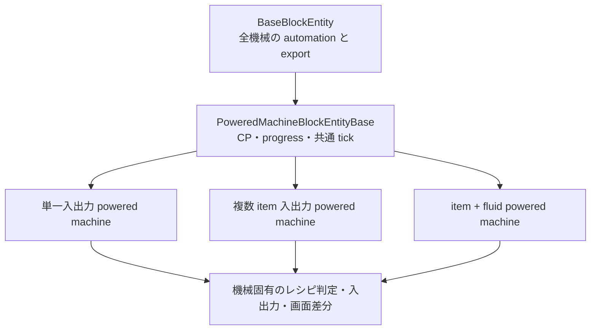

# 機械共通化 長期ロードマップ

この文書は、既存の [機械共通化設計メモ](./machine-commonization-plan.md) と [Powered Furnace 共通化作業計画](./powered-furnace-commonization-plan.md) を次の段階へ進めるための長期計画です。

目的は、機械の挙動を一律にすることではありません。**本当に同じ処理だけを共通化し、機械固有の仕様は小さく明示的に残す**ことです。

この方針により、次を目指します。

1. 新しい機械を追加するときに、既存機械を丸ごと複製しない
2. progress、丸石電力、保存、automation、GUI の修正箇所を減らす
3. 多入力・複数出力・液体を持つ機械でも、役割を追いやすくする
4. 既存ワールド、automation、JEI、datagen の互換性を壊さずに移行する
5. 明らかに他の機械とズレのある実装は、リファクタリングで共通化できないかを検討する

## 1. 現在地

すでに、単一入力・単一出力を中心とする powered machine 系には土台があります。

| 層 | 現在の共通基盤 | 主な責務 |
| --- | --- | --- |
| 全機械 | [BaseBlockEntity](../src/main/java/com/yukke9265/cobblestone_xx_compressed/blockentity/BaseBlockEntity.java) | 面ごとの item / fluid automation、auto export、capability 更新、upgrade の基本操作 |
| powered BlockEntity | [PoweredMachineBlockEntityBase](../src/main/java/com/yukke9265/cobblestone_xx_compressed/blockentity/PoweredMachineBlockEntityBase.java) | CP 蓄積、進捗、tick 骨格、停止、保存、共通 `ContainerData` |
| Menu | [PoweredMachineMenuBase](../src/main/java/com/yukke9265/cobblestone_xx_compressed/menu/PoweredMachineMenuBase.java) | 有効範囲判定、プレイヤーインベントリ、Shift+クリックの骨格、JEI 転送定義 |
| Screen | [PoweredMachineScreenBase](../src/main/java/com/yukke9265/cobblestone_xx_compressed/screen/PoweredMachineScreenBase.java) | CP / progress 描画、start/stop、auto export、automation パネル |
| GUI 定数 | [MachineGuiLayouts](../src/main/java/com/yukke9265/cobblestone_xx_compressed/util/MachineGuiLayouts.java) | 標準および機械ごとのスロット・バー座標 |
| 機械レシピ datagen | [MachineRecipeOutputHelper](../src/main/java/com/yukke9265/cobblestone_xx_compressed/datagen/recipe/MachineRecipeOutputHelper.java) | レシピ ID と `RecipeOutput` 出力の共通入口 |

Crusher、Extreme Compressor、Powered Furnace は、上記の powered machine 基盤を利用する代表例です。まずはこの系統を安定させ、次に「形が近い別系統」へ広げます。

## 2. 最終的に目指す構造

機械を 1 本の巨大な継承ツリーに入れません。次の 4 層を保ちます。

### 2-1. Base に置くもの

次の条件をすべて満たすものだけを Base に置きます。

1. 複数の機械で意味も処理順も同じ
2. 変更時に一括修正した方が安全
3. 引数名や抽象メソッド名だけで役割を説明できる

具体例は、automation mode の保存、capability 無効化、CP の lower / upper 同期、停止時の共通処理、標準 GUI のボタン操作です。

### 2-2. 機械側に残すもの

次は機械側に残します。

1. レシピの検索と一致判定
2. 入力・出力スロットの意味と順番
3. 完成時に消費・生成する item / fluid
4. 出力詰まり時に進捗を破棄する条件
5. 特殊 GUI の座標、追加ラベル、JEI の表示内容

これらは見た目が似ていても仕様が変わりやすいため、無理に共通化しません。

## 3. 機械を分類してから進める

移行対象を「コード量」ではなく、入出力構成で分類します。各フェーズでは 1 機械ずつ移行し、共通基盤の不足を確認してから次へ進みます。

| 系統 | 代表機械 | 主な差分 | 優先度 |
| --- | --- | --- | --- |
| 標準 powered | Crusher、Extreme Compressor、Powered Furnace | item 1入力・1出力、CP、upgrade | 完了・維持 |
| 複数 item | Mixer、Centrifuge、Laser Drill、Stone Break Simulator | 2以上の入力または出力、出力順序 | 高 |
| item + fluid | Melter、Dissolution Chamber、Crystallization Chamber、Reaction Chamber | fluid tank、容器処理、fluid automation | 中 |
| 複雑複合 | Chemical Reactor、Assembly Machine、Fluid Mixer | 複数 item と複数 fluid、個別レシピ構造 | 中・後半 |
| 特殊用途 | Enchanter、Tank、FE Generator、Generator | レシピ加工以外の固有状態 | 個別設計 |
| 非 powered | Cobblestone Furnace | 燃料燃焼の状態遷移 | powered 基盤には入れない |

## 4. 変更しない互換性契約

共通化の各 PR / 作業単位で、以下を守ります。これらを破る変更は、共通化作業とは別の仕様変更として扱います。

1. BlockEntity の登録 ID、BlockEntityType、ブロック ID を変えない
2. 既存 inventory のスロット番号と NBT キーを変えない
3. recipe type、serializer ID、生成されるレシピ JSON のパスを変えない
4. automation mode の数値 ID と面の意味を変えない
5. item / fluid capability の公開条件を変えない
6. JEI category ID と recipe transfer の入力スロットを変えない
7. CP が足りないだけのときは進捗を維持し、材料不一致・出力詰まり・停止・recipe 消失時だけ進捗を破棄する。現在この条件と異なる機械は、移行時に明示的な仕様変更として統一する

特に `ContainerData` の index は GUI 同期の通信契約です。既存 index の意味を変えず、追加データは後ろへ追加します。

## 5. 実施フェーズ

### Phase 0: 現状を固定する

目的は、移行前後を比較できる状態を作ることです。機能追加より先に、機械ごとの仕様を短く記録します。

各機械について、次を表にします。

1. item スロット番号と役割
2. fluid tank 番号と役割
3. 入出力可能な automation mode
4. recipe type、入出力、CP/t、総 CP
5. progress を reset する条件
6. NBT キーと `ContainerData` の index
7. Menu / Screen / JEI category の対応先

成果物は、機械ごとの実装メモまたは 1 つの一覧です。この表がない機械は移行しません。

### Phase 1: powered 基盤を固定する

対象は Crusher、Extreme Compressor、Powered Furnace です。

1. 3 機械の GUI、Shift+クリック、automation、JEI、進捗挙動を手動確認する
2. `PoweredMachineBlockEntityBase` に新しい抽象メソッドを増やす前に、3 機械すべてで本当に必要か確認する
3. 3 機械で共有できる automation handler の生成処理だけを、小さな helper として切り出す
4. 反射で upgrade slot を探索する現在の仕組みは、新しい共通化で増やさない。新規の中間基盤では明示的な hook を優先する

この段階で、標準 powered machine を追加するための最小テンプレートを確立します。

### Phase 2: 複数 item 入出力を扱える共通部品を作る

最初の移行候補は Centrifuge、次が Mixer です。両者は「CP を使う加工機械」ですが、複数出力と複数入力という異なる差分を確認できます。

このフェーズで追加を検討する共通部品は、継承先の代わりに処理を決めないものに限ります。

1. スロット番号の配列を受け取る、限定公開の item handler helper
2. 指定した出力スロットを順番に auto export する helper
3. machine-specific data 数から automation / rate / auto export の index を計算する helper
4. 入力、CP 入力、出力、全アクセスを明示して返す automation routing helper

`findMatchingRecipe()`、消費量、出力作成は引き続き各 BlockEntity に残します。

現在の Centrifuge と Mixer は CP 不足時にも progress を reset する独自の `tick()` を持ちます。Phase 2 で `PoweredMachineBlockEntityBase` へ移す際は、CP 不足だけなら progress を維持する標準挙動へ意図的に統一します。これは互換性契約の例外ではなく、記録した仕様変更として扱います。

複数出力のために基底クラスを大きくせず、既定の単一出力搬出を置き換えられる小さな hook を追加します。Centrifuge は出力 1、出力 2 の順で搬出し、各出力の公開 mode を維持します。

完了条件は、Centrifuge と Mixer で匿名 `IItemHandler` の重複が減り、スロットごとの許可ルールが今より読みやすくなることです。

### Phase 3: item + fluid の共通契約を設計する

実装を急がず、先に Melter、Dissolution Chamber、Crystallization Chamber、Reaction Chamber の比較表を作ります。

決める項目は次です。

1. tank の番号と input / output / internal の役割
2. fluid automation mode が `INPUT`、`OUTPUT`、`IN_OUT` のときに公開する handler
3. バケツ・容器との入出力をどこで処理するか
4. item と fluid のどちらが詰まったときに進捗を reset するか
5. auto export の item と fluid の実行順
6. `ContainerData` と Screen で同期する fluid 表示値

この結果を基に、`PoweredMachineBlockEntityBase` を直接肥大化させるのではなく、fluid を持つ機械だけの小さな中間基盤または helper 群を選びます。

### Phase 4: 複雑複合機械へ展開する

対象は Chemical Reactor、Assembly Machine、Fluid Mixer です。

これらは item と fluid の数が多く、レシピの一致条件も複雑です。Phase 3 の契約で扱えない部分を先に明確にします。

1. レシピ判定は機械固有のままにする
2. 共通化は保存、automation routing、CP / progress、出力搬出の順に限定する
3. 1 機械の移行後に、ワールドを再起動して保存データを確認する
4. 3 機械すべてへ一括適用しない。最初は Chemical Reactor のみで検証する

### Phase 5: UI、JEI、datagen をテンプレート化する

BlockEntity の移行が安定してから、周辺層の重複を整理します。

#### UI

1. `MachineGuiLayouts` に標準レイアウトの再利用部を残す
2. 複数スロットや fluid 表示は、座標セットを機械固有の値として渡す
3. `PoweredMachineScreenBase` から、機械固有の描画判断を増やさない

#### JEI

1. category の共通部分は、背景、スロット、CP 表示の小さな描画 helper にする
2. `setRecipe()` と特殊表示の座標は各 category に残す
3. category ID と transfer 定義は既存のままにする

#### datagen

1. [MachineRecipeOutputHelper](../src/main/java/com/yukke9265/cobblestone_xx_compressed/datagen/recipe/MachineRecipeOutputHelper.java) の「生成先 ID を決めて出力する」役割を維持する
2. 単入力、複数 item、item + fluid のレシピ構造ごとに小さな builder / helper を分ける
3. 全 recipe class を 1 つの巨大なジェネリック recipe class に統合しない
4. `MachineRecipePowerTiers` を CP バランスの唯一の基準として維持する

### Phase 6: 新規機械の追加手順を定着させる

共通化後は、機械を追加するときに次の順で実装します。

1. 系統を選ぶ: 標準 powered、複数 item、item + fluid、特殊用途
2. 既存の最も近い機械を 1 つだけ参照する
3. BlockEntity の固有差分を実装する
4. Menu / Screen / JEI の座標と表示差分を実装する
5. datagen、登録、capability を追加する
6. 下記の確認表で動作を検証する

この手順は、共通基盤が安定した時点で [機械系ブロック手順](./machine-block-guide.md) と機械追加用 skill に反映します。

## 6. 小さな作業単位のルール

長期計画を安全に進めるため、1 回の変更は次のどれか 1 つに限定します。

1. helper を追加し、既存機械 1 台で利用する
2. 既存 helper を 1 台だけ別の機械へ展開する
3. 1 台の Menu / Screen / BlockEntity を共通基盤へ移す
4. 1 種類の recipe 構造に限って datagen / JEI を整理する

1 回の変更で BlockEntity、Menu、Screen、JEI、datagen のすべてを同時に書き換えません。例外は、新規機械の追加だけです。

## 7. 実装前の判断表

| 判断 | 共通化する | 共通化しない |
| --- | --- | --- |
| CP の保存・吸収・同期 | はい | - |
| progress の増加骨格 | はい | recipe ごとの reset 条件 |
| inventory NBT の読込 | 共通手順 | スロット番号・個別追加 NBT |
| automation mode の保存 | はい | 各 mode が公開するスロット / tank |
| item auto export | 出力スロット順の helper | 出力順序の意味 |
| fluid auto export | 実行の共通入口 | tank の公開・充填ルール |
| `ContainerData` | 共通領域と offset 計算 | 機械固有値の意味 |
| Screen | ボタン・CP・progress | 特殊スロット、特殊ラベル |
| JEI | 共通描画部品 | recipe の見せ方 |
| recipe | codec の小さな部品 | recipe type、入力照合、出力構造 |

## 8. 検証チェックリスト

### 8-1. すべての共通化変更

1. `compileJava` が通る
2. 既存ワールドで BlockEntity を読み込める
3. ブロック破壊・再設置後に inventory と設定が正しく保存される
4. start/stop と block の点灯状態が一致する
5. CP 不足で進捗が維持され、CP 回復後に再開する
6. 入力不一致、出力詰まり、停止時にのみ進捗が reset する

### 8-2. automation を変更した場合

1. 各面の mode 変更後に隣接ホッパー / パイプの挙動が変わる
2. `INPUT` では出力の抜き取りができない
3. `OUTPUT` では入力の挿入ができない
4. `IN_OUT` が機械ごとの意図どおりに動く
5. auto export の有無で出力が変わる
6. item と fluid の設定が互いに干渉しない

### 8-3. Menu / Screen / JEI を変更した場合

1. GUI を開閉できる
2. `ContainerData` の表示値がずれない
3. Shift+クリックの投入先が変わっていない
4. automation ボタンの左右クリックが正しく動く
5. JEI のクリック領域、recipe transfer、カテゴリ表示が機能する

### 8-4. datagen を変更した場合

1. `runData` が完了する
2. 生成された recipe JSON の ID と内容が意図どおり
3. recipe の CP/t と総 CP が `MachineRecipePowerTiers` の定義と一致する
4. `build` または `runClient` で実際のレシピを確認する

## 9. 優先順位

次回以降は次の順で進めます。

1. Phase 0 の比較表を作り、現状の仕様と統一対象の差分を固定する
2. Phase 1 で標準 powered machine の automation handler 重複を小さく減らす
3. Phase 2 で Centrifuge を試験移行する
4. Centrifuge の結果を反映して Mixer を移行する
5. Phase 3 の fluid 契約を設計文書として確定する
6. Phase 4 以降を 1 機械ずつ進める

## 10. 完了の定義

「すべての機械が同じ基底を継承している」ことは完了条件ではありません。次を満たしたとき、この共通化は成功と判断します。

1. 新しい標準 powered machine を、既存の 1 台を複製せず追加できる
2. 複数入出力と fluid 機械で、共通処理と固有処理の境界を説明できる
3. automation、保存、同期、JEI、datagen の責務が重複せず追える
4. 機械固有の仕様変更が、他の機械を意図せず変えない
5. 共通基盤の変更後に、上記のチェックリストで回帰確認できる
